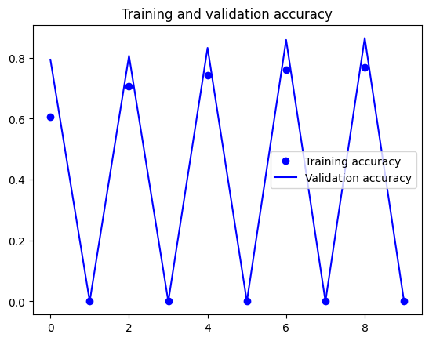
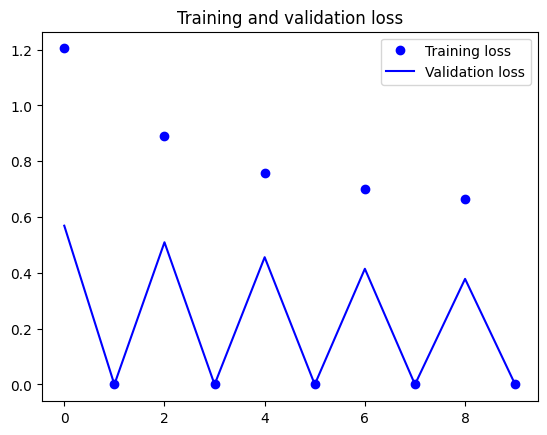
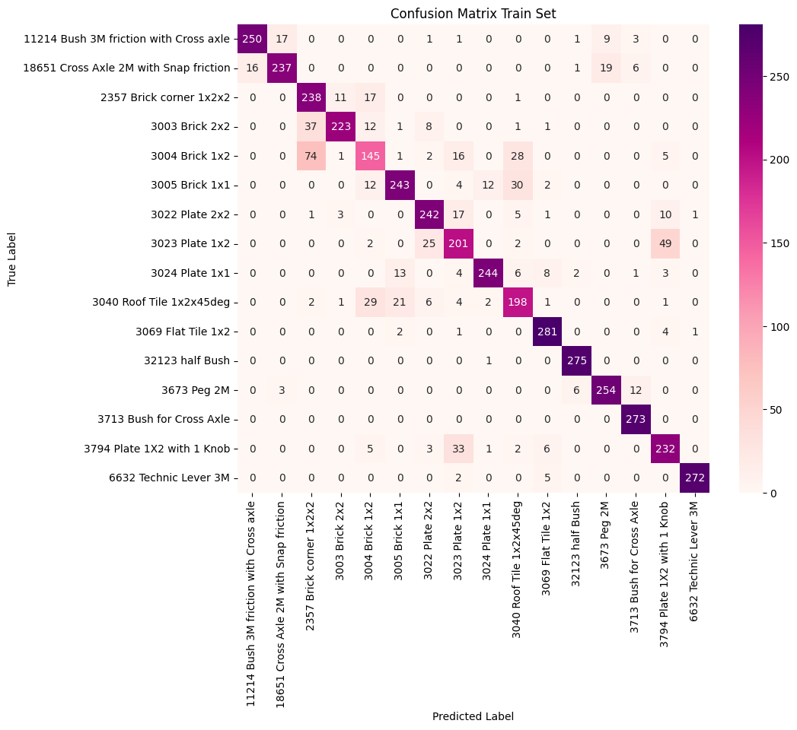
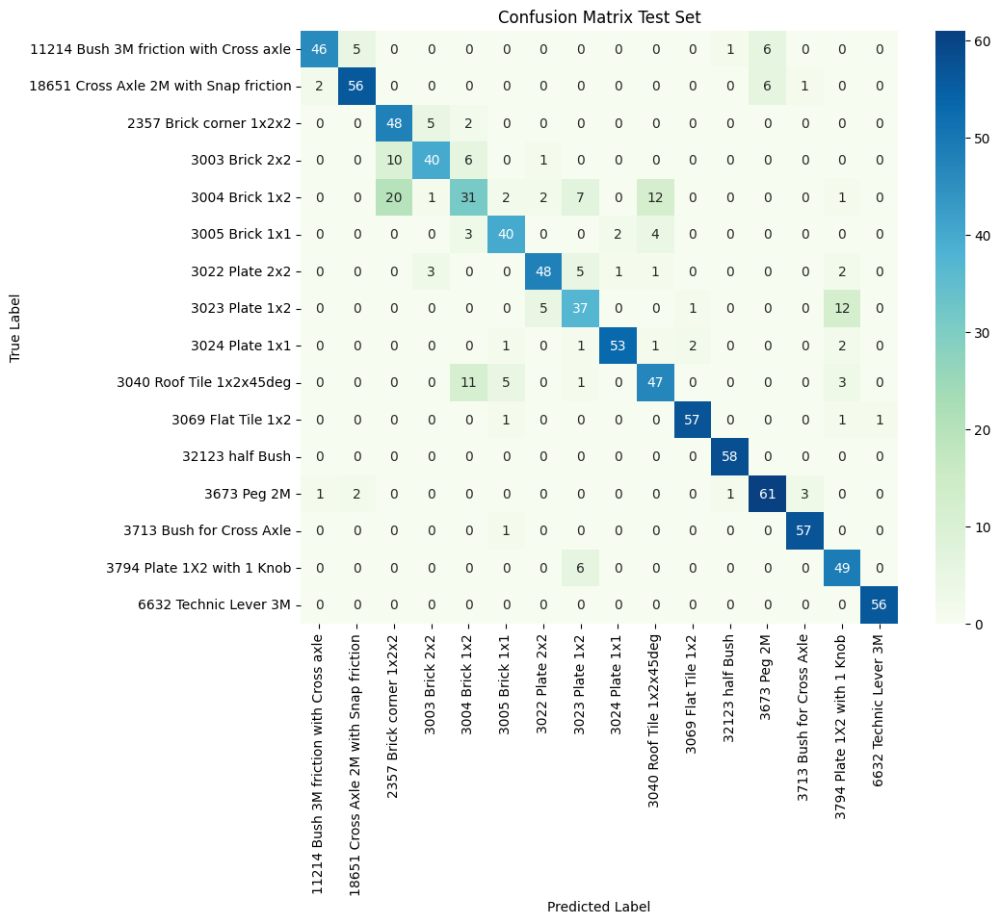
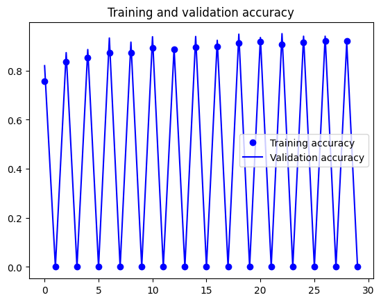
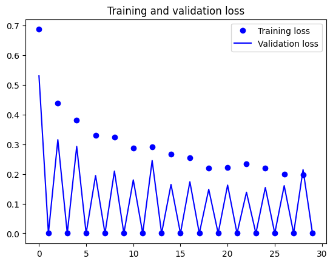
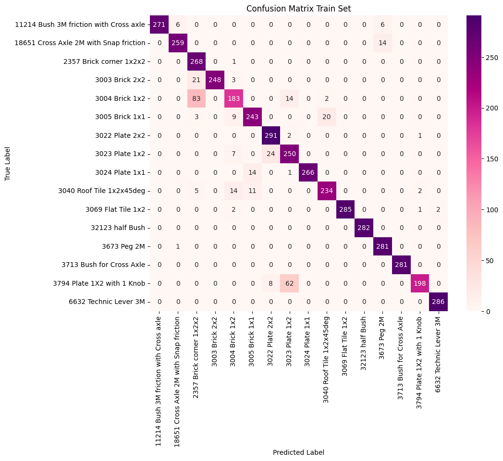
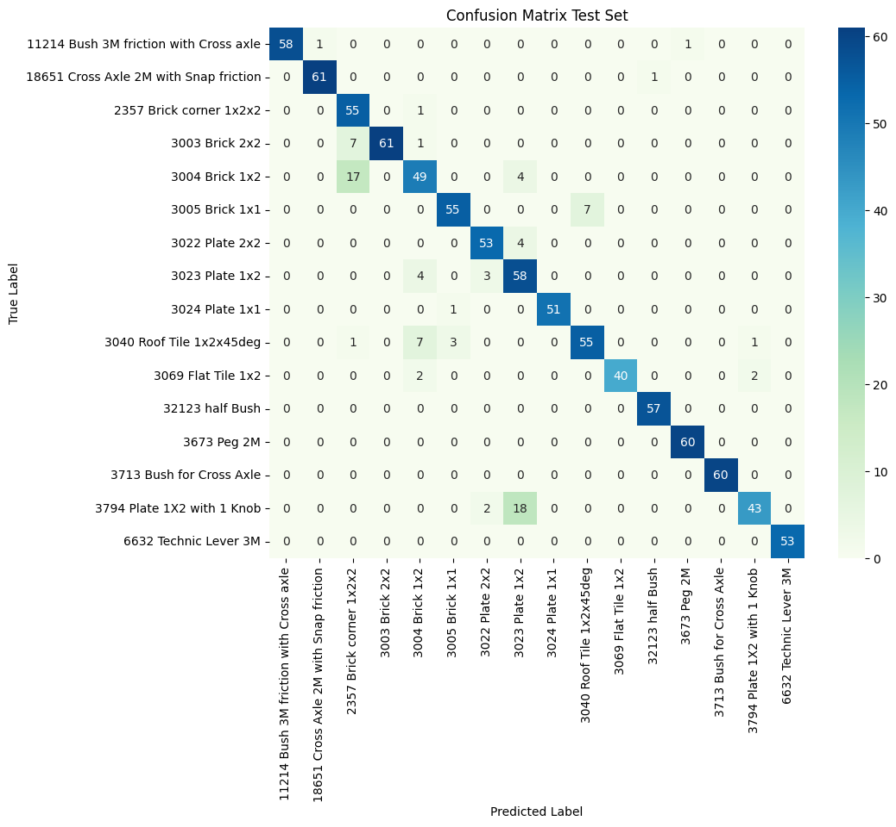

# LEGO Brick Images Dataset
## TC3002B
### Alejandro Martínez Luna - A01276785

## Tabla de Contenido

- [Descripción](#descripción)
- [Fuente de Datos](#fuente-de-datos)
- [Información Detallada](#información-detallada)
- [Conjunto de Datos](#conjunto-de-datos)
- [Implementación del Modelo](#implementación-del-modelo)
    - [Modelo](#modelo)
        - [Resumen del Modelo](#resumen-del-modelo)
        - [Entrenamiento](#entrenamiento)
    - [Resultados y comparación de modelos](#resultados-y-comparación-de-modelos)
        - [Modelo sin Refinar](#modelo-sin-refinar)
        - [Refinamiento de modelo](#refinamiento-de-modelo)
    - [Conclusiones](#conclusiones)
    - [Referencias Consultadas](#referencias-consultadas)
## Descripción

El dataset empleado contiene **40,000 imágenes** de **50 ladrillos LEGO diferentes**. Las imágenes fueron recopiladas y etiquetadas para su uso en tareas de clasificación y análisis de imágenes relacionadas con los ladrillos LEGO.

## Fuente de Datos

Las imágenes fueron obtenidas del conjunto de datos titulado [Imágenes de Ladrillos LEGO en Kaggle](https://www.kaggle.com/datasets/joosthazelzet/lego-brick-images). Este conjunto de datos proporciona una amplia variedad de imágenes de ladrillos LEGO.

## Información Detallada

- **Fecha de Creación o Última Actualización:** El conjunto de datos fue creado originalmente por **Joost Hazelzet** y ha estado disponible en Kaggle durante varios años.
- **Autores o Creadores:** Joost Hazelzet.
- **Formato de los Datos:** Imágenes digitales (JPEG, PNG, etc.).
- **Tamaño del Conjunto de Datos:** 40,000 imágenes en total.
- **Distribución de Clases:**
    - Cada imagen representa un **ladrillo LEGO específico**.
    - Hay **50 clases diferentes** de ladrillos LEGO en el conjunto de datos.
- **Preprocesamiento Aplicado:** Las imágenes se proporcionan en su formato original, sin un preprocesamiento específico. Sin embargo, los usuarios pueden aplicar sus propias técnicas de preprocesamiento según sea necesario.

## Conjunto de Datos

El conjunto de datos original utilizado en este código no está incluido en este repositorio debido a su tamaño. Sin embargo, puedes acceder al conjunto de datos modificado desde este [enlace de Google Drive](https://drive.google.com/drive/folders/1Ue-ZbK7UUYzEtVTQOHjzfBG0p6RI8nik?usp=sharing).

El conjunto de datos está dividido en tres carpetas: `train`, `test` y `validation`.  

La carpeta `train` contiene **4,465** imágenes, mientras que la carpeta `test` contiene **957** imágenes y la carpeta `validation` contiene **957** imágenes. Cada imagen está etiquetada con la clase correspondiente de ladrillo LEGO.

En su total hay **16 clases** de ladrillos LEGO en el conjunto de datos de entrenamiento, **16 clases** en el conjunto de datos de prueba y **16 clases** en el conjunto de datos de validación.

Las imágenes del conjunto de datos fueron obtenidas del [sitio de Kaggle](https://www.kaggle.com).

# Implementación del Modelo
Para la implementación del modelo, se realizó una investigación y revisión de los siguientes papers:

- ["The Current State of the Art in Multi-Label Image Classification Applied on LEGO Bricks"](https://repository.tudelft.nl/islandora/object/uuid%3Af594616d-d8c9-47af-bcba-46fc23699fd0)
- ["Learning Stackable And Skippable Lego Bricks For Efficient, Reconfigurable, And Variable-Resolution Diffusion Modeling"](https://arxiv.org/pdf/2310.06389.pdf)
- ["Photos and rendered images of LEGO bricks"](https://www.nature.com/articles/s41597-023-02682-2.pdf)

La implementación del modelo fue basado en el repositorio que podemos encontrar en el paper "Photos and rendered images of LEGO bricks". 

[Enlace el repositorio](https://github.com/LegoSorter)  

## Modelo

El modelo utilizado en este es InceptionV3, una red neuronal convolucional (CNN) pre-entrenada. Las CNN son particularmente efectivas para tareas de clasificación de imágenes debido a su capacidad para aprender características jerárquicas de las imágenes. 

La arquitectura del modelo consiste en múltiples capas convolucionales seguidas de capas de agrupación máxima para extraer características de las imágenes de entrada. Luego incluye capas completamente conectadas para la clasificación.

## Resumen del Modelo **(Sin Refinar)**:

- **Forma de Entrada:** (150, 150, 3) - Representa las dimensiones de las imágenes de entrada (150x150 píxeles con 3 canales de color).
- **Capas Convolucionales:** InceptionV3 contiene múltiples capas convolucionales que se utilizan para extraer características de las imágenes de entrada.
- **Capas de Agrupación:** InceptionV3 utiliza capas de agrupación máxima para reducir las dimensiones espaciales de los mapas de características.
- **Capas Densas:** Una capa completamente conectada con 1024 neuronas y activación ReLU, seguida de la capa de salida con 16 neuronas (una para cada clase de bloque de LEGO) y activación softmax.
- **Función de Pérdida:** Entropía Cruzada Categórica - Adecuada para tareas de clasificación multiclase.
- **Optimizador:** SGD con una tasa de aprendizaje de 0.0001 y momentum de 0.9 - Un algoritmo de optimización que ajusta la tasa de aprendizaje durante el entrenamiento.
- **Métricas:** Precisión - Evalúa el rendimiento del modelo durante el entrenamiento y la validación.

## Entrenamiento:

El modelo se entrena en dos etapas:
  - **Etapa 1:**
    - Se utiliza un modelo base pre-entrenado (InceptionV3) para extraer características de las imágenes.
    - Se agregan capas personalizadas para la clasificación de los ladrillos LEGO.
    - Las capas del modelo base se congelan para evitar que se actualicen durante el entrenamiento.
    - Se compila el modelo con un optimizador RMSprop y se entrena durante 5 épocas.
  - **Etapa 2:**
    - Se descongelan algunas capas del modelo base para permitir el ajuste fino.
    - Se compila el modelo nuevamente con un optimizador SGD y se entrena durante 10 épocas adicionales.
- Se utilizan callbacks para el registro de eventos en TensorBoard y para guardar los mejores modelos durante el entrenamiento.
- El modelo se evalúa en un conjunto de datos de prueba después del entrenamiento.
- Finalmente, se guardan los mejores modelos y se visualiza el proceso de entrenamiento mediante gráficos de precisión y pérdida.

## Resultados y comparación de modelos:

### Modelo sin Refinar
| Métrica          | Valor obtenido |
|------------------|----------------|
| **Accuracy**     | *0.8293*       |
| **Loss**         | *0.4520*       |
| **Val_Accuracy** | *0.8652*       |
| **Val_Loss**     | *0.3784*       |

**Test Accuracy:**  
*0.8192*

El modelo sin refinar muestra un rendimiento decente, pero hay margen para mejoras. La precisión de la validación es más alta que la precisión del entrenamiento, lo que indica un underfitting. 

Esto sugiere que el modelo podría beneficiarse de un entrenamiento más prolongado o de un aumento en la complejidad del modelo. Además, la precisión de la prueba es ligeramente más baja que la precisión de la validación, lo que indica un ligero overfitting. Esto sugiere que el modelo podría beneficiarse de técnicas de regularización para mejorar su capacidad de generalización a nuevos datos.

### Matriz de confusión de Train:

### Matriz de confusión de Test:

La *matriz de confusión* y el informe de clasificación proporcionan una visión detallada del rendimiento del modelo en cada clase individualmente. 

El modelo tiene una precisión general de 0.82, lo que significa que el 82% de todas las predicciones en el conjunto de prueba son correctas.

La precisión (precision) para cada clase, que es la proporción de verdaderos positivos sobre el total de positivos predichos, varía bastante.

## Refinamiento de modelo:
Se realizaron varios cambios para mejorar la precisión del modelo. Aquí están los cambios más significativos y las justificaciones para cada uno:

1. **Incremento de épocas en ambas etapas de entrenamiento:** En la etapa 1, el número de épocas se incrementó de **5** a **10**. En la etapa 2, el número de épocas se incrementó de **10** a **30**. 

2. **Cambio de optimizador en la segunda etapa de entrenamiento:** En la segunda etapa de entrenamiento, se cambió el optimizador de `SGD` a `Adam`. Adam es un optimizador que combina las ventajas de otros dos optimizadores de aprendizaje automático, RMSProp y Momentum. Adam es generalmente considerado como más eficiente que SGD y a menudo logra mejores resultados en menos tiempo. 

3. **Adición de un fondo a las imágenes de entrenamiento:** Se definió una función `add_background(image)` que agrega un fondo blanco a las imágenes que tienen un canal alfa (transparencia) Este cambio se realizó para asegurar que todas las imágenes se procesen correctamente y potencialmente mejorar la precisión del modelo.

4. **Aumento de datos:** Se utilizó la clase `ImageDataGenerator` de Keras para realizar el aumento de datos en las imágenes de entrenamiento. El aumento de datos es una técnica que crea nuevas imágenes de entrenamiento a través de la aplicación de transformaciones aleatorias. Esto puede ayudar a prevenir el sobreajuste y mejorar la precisión del modelo al proporcionar más variedad en los datos de entrenamiento. 

5. **Cambio en el tamaño de lote:** Se cambió el tamaño del lote de las imágenes de entrenamiento a `64`. Un tamaño de lote más grande puede permitir que el modelo se entrene más rápido, ya que se procesan más imágenes a la vez. 

### A continuación se presentan los resultados del modelo refinado:

| Métrica          | Valor obtenido |
|------------------|----------------|
| **Accuracy**     | *0.9017*       |
| **Loss**         | *0.2207*       |
| **Val_Accuracy** | *0.9154*       |
| **Val_Loss**     | *0.2143*       |

**Test Accuracy:**  
*0.9080*

El modelo refinado muestra una mejora significativa en comparación con el modelo sin refinar. Además, la pérdida en el conjunto de entrenamiento y validación disminuyó a 0.2207 y 0.2143 respectivamente, lo que sugiere que el modelo es más confiable y tiene un mejor rendimiento general. La precisión en el conjunto de prueba también aumentó a 0.9080, lo que demuestra que el modelo refinado es más efectivo para generalizar a nuevos datos.

### Matriz de confusión de Train:

### Matriz de confusión de Test:

## Conclusiones:

| Métrica           | Modelo Original | Modelo Refinado |
|-------------------|-----------------|-----------------|
| **Accuracy**      | 0.8293          | 0.9017          |
| **Loss**          | 0.4520          | 0.2207          |
| **Val_Accuracy**  | 0.8652          | 0.9154          |
| **Val_Loss**      | 0.3784          | 0.2143          |
| **Test Accuracy** | 0.8192          | 0.9080          |

- El **Modelo Refinado** muestra una mejora en todas las métricas en comparación con el **Modelo Original**. Esto indica que los ajustes realizados en el modelo refinado han tenido un impacto positivo en su rendimiento.

- La pérdida de validación es menor que la pérdida de entrenamiento en ambos modelos, lo que también apunta a un caso de **underfitting**. Esto sugiere que los modelos podrían beneficiarse de un entrenamiento más prolongado o de un aumento en la complejidad del modelo.

- La mejora en la precisión del test del **Modelo Refinado** sugiere que los cambios realizados han ayudado a generalizar mejor el modelo a nuevos datos, reduciendo el riesgo de **overfitting**.

Basándonos en los resultados de ambos modelos, podemos concluir que el refinamiento del modelo ha sido exitoso, logrando una mejora significativa en todas las métricas. Sin embargo, aún hay espacio para mejorar y optimizar.
## Referencias Consultadas
- Images of LEGO bricks. (2019, December 31). https://www.kaggle.com/datasets/joosthazelzet/lego-brick-images